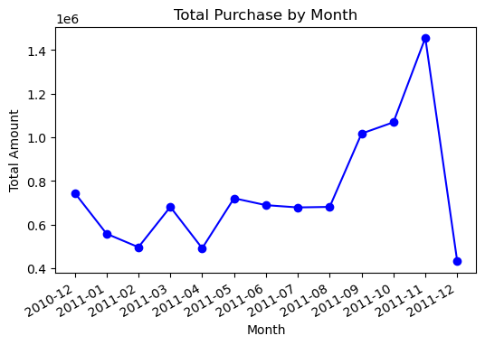
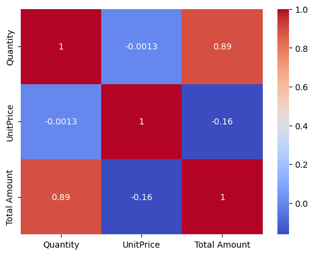
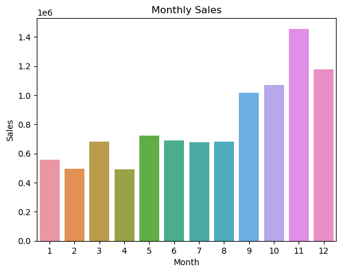
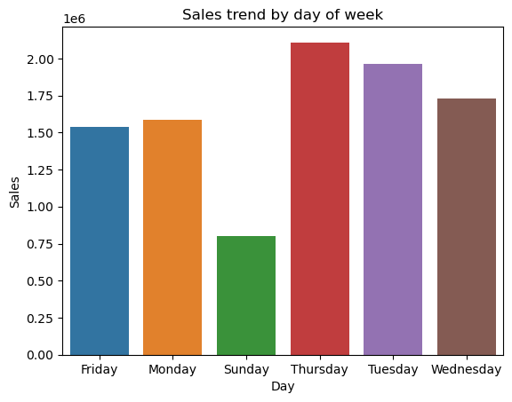
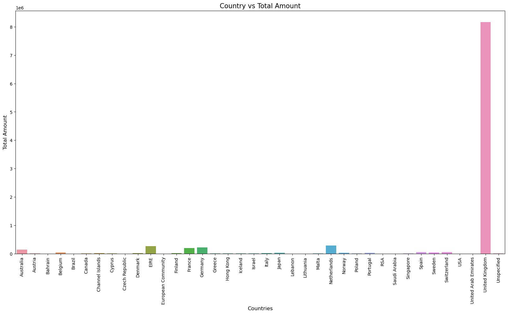
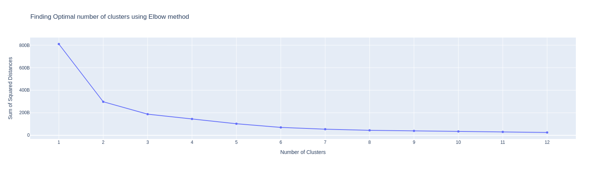

# Online Retail Data Analysis

---

## Project Overview
This project analyzes an Online Retail dataset to uncover insights about sales trends, customer behavior, top-selling products, and purchasing patterns across different countries. The analysis includes data cleaning, exploratory data analysis (EDA), visualizations, and clustering using the KMeans algorithm to segment customers or products.

The dataset used is `OnlineRetail.csv`, which contains transactional data with details like invoice date, customer ID, product descriptions, quantities, unit prices, and countries.

---

## Features
- **Data Cleaning**: Handling missing values, duplicates, and data type conversions.
- **Exploratory Data Analysis**:
  - Total purchase trends by month.
  - Sales trends by month and day of the week.
  - Identification of top customers, products, and countries by sales.
  - Most bought items in specific countries (e.g., UK, Netherlands) for 2010 and 2011.
- **Visualizations**:
  - Line plot for monthly purchase trends.
  - Heatmap for correlation analysis.
  - Bar plots for monthly and daily sales trends.
  - Bar plot for country-wise sales.
- **Clustering**: KMeans clustering to segment data based on product descriptions, quantities, unit prices, countries, and total amount, with the optimal number of clusters determined using the Elbow method.

---

## Prerequisites
To run the analysis, ensure you have the following installed:
- Python 3.10+
- Required Python libraries:
  ```bash
  pip install -r requirements.txt
  ```

---

## Installation
1. Clone this repository:
   ```bash
   git clone https://github.com/Jay24-coder/Online_Retail.git
   cd Online_Retail
   ```
2. Install the required dependencies:
   ```bash
   pip install -r requirements.txt
   ```
3. Ensure the dataset `OnlineRetail.csv` is in the project directory.

---

## Usage
1. Place the `OnlineRetail.csv` file in the root directory of the project.
2. Open the Jupyter notebook `OnlineRetail_Analysis.ipynb` or run the Python script containing the analysis code.
3. Execute the cells sequentially to perform data cleaning, analysis, visualization, and clustering.
4. The notebook generates various outputs, including:
   - Summary statistics and data insights.
   - Visualizations saved as images (e.g., `monthly_sales.png`, `daily_sales.png`).
   - Clustering results and the Elbow method plot.

---

## Visualizations
Below are placeholders for key visualizations generated by the analysis. To display these images in the README, host them in the repository (e.g., in a `/images` folder) or on an external service and update the links accordingly.

### Total Purchase by Month


### Correlation Heatmap


### Monthly Sales


### Sales by Day of the Week


### Country-wise Sales


### Elbow Method for Clustering


---

## Dataset
The dataset `OnlineRetail.csv` contains the following columns:
- `InvoiceNo`: Invoice number (dropped in analysis).
- `StockCode`: Product code (dropped in analysis).
- `Description`: Product description.
- `Quantity`: Number of items purchased.
- `InvoiceDate`: Date and time of the transaction.
- `UnitPrice`: Price per unit.
- `CustomerID`: Customer identifier.
- `Country`: Country of the customer.
- Derived columns: `Total Amount`, `MonthYear`, `Month`, `Day`, `Year`.

---

## Analysis Highlights
- **Busiest Month and Day**: Identified the month and day of the week with the highest sales.
- **Top Customers**: Listed the top 10 customers by total purchase amount.
- **Top Products**: Identified the best-selling products based on total sales.
- **Top Countries**: Ranked countries by total sales.
- **Most Bought Items**: Determined the most purchased items in the UK and Netherlands for 2010 and 2011.
- **Clustering**: Applied KMeans clustering to segment data, with the optimal number of clusters determined using the Elbow method.

---

## Contributing
Contributions are welcome! Please submit a pull request or open an issue to discuss improvements or additional analyses.